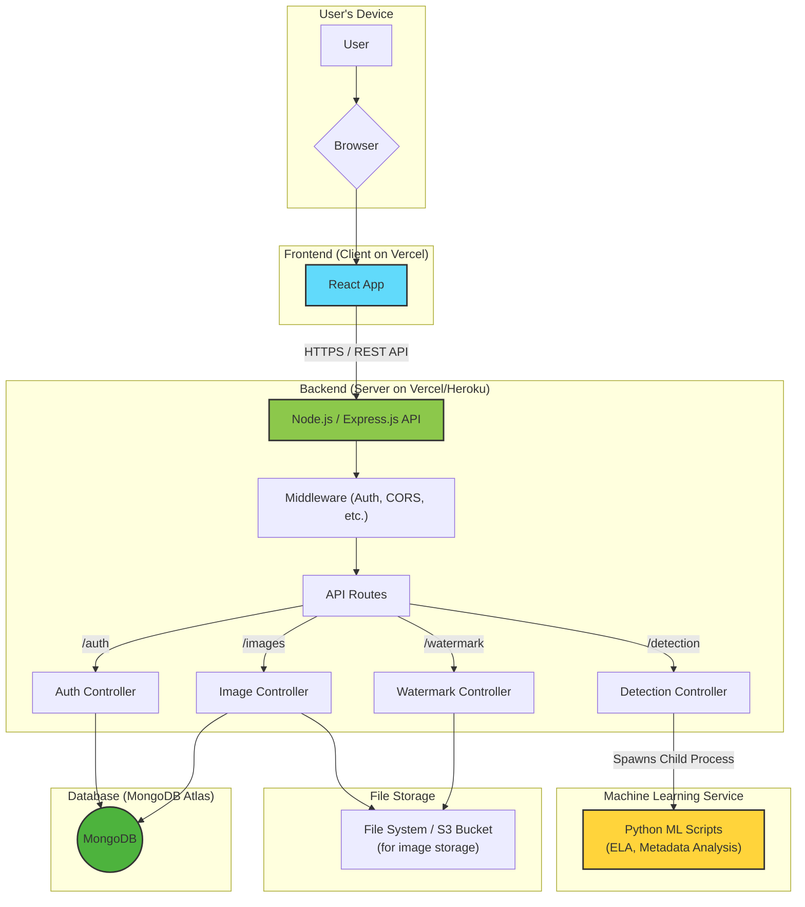

# Application Architecture Diagram

This document contains a diagram representing the architecture of the Image Forgery Detection and Watermarking application.

```mermaid
graph TD
    subgraph "User's Device"
        A[User]
        B{Browser}
    end

    subgraph "Frontend (Client on Vercel)"
        C["React App"]
    end

    subgraph "Backend (Server on Vercel/Heroku)"
        D["Node.js / Express.js API"]
        E["Middleware (Auth, CORS, etc.)"]
        F["API Routes"]
        G["Auth Controller"]
        H["Image Controller"]
        I["Watermark Controller"]
        J["Detection Controller"]
    end

    subgraph "Database (MongoDB Atlas)"
        K((MongoDB))
    end
    
    subgraph "File Storage"
        L["File System / S3 Bucket <br/> (for image storage)"]
    end

    subgraph "Machine Learning Service"
        M["Python ML Scripts <br/> (ELA, Metadata Analysis)"]
    end

    A --> B
    B --> C
    C -- "HTTPS / REST API" --> D
    D --> E --> F
    F -- "/auth" --> G --> K
    F -- "/images" --> H
    H --> K
    H --> L
    F -- "/watermark" --> I --> L
    F -- "/detection" --> J
    J -- "Spawns Child Process" --> M

    style C fill:#61DAFB,stroke:#333,stroke-width:2px
    style D fill:#8CC84B,stroke:#333,stroke-width:2px
    style K fill:#4DB33D,stroke:#333,stroke-width:2px
    style M fill:#FFD43B,stroke:#333,stroke-width:2px
``` 